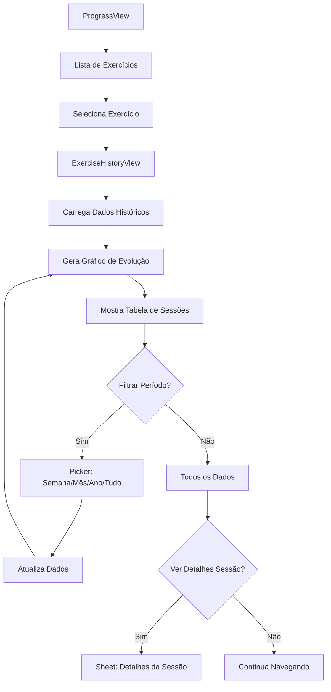

# Guia de Fluxos de Usuário - BumbumNaNuca

## Visão Geral

Este documento mapeia todos os fluxos de usuário do aplicativo, desde onboarding até funcionalidades avançadas, detalhando cada passo, decisão e interação.

---

## 1. Estrutura de Navegação Global

### 1.1 TabView Principal

```
┌─────────────────────────────────────────┐
│           TabView (Bottom Bar)          │
├─────────────────────────────────────────┤
│  🏠 Home  │ 💪 Treinos │ 📊 Progresso │ 📅 Frequência │
└─────────────────────────────────────────┘
```

### 1.2 Hierarquia de Navegação

```
App Root
└── ContentView (TabView)
    ├── Tab 1: Home Flow
    │   └── NavigationStack
    │       ├── HomeView
    │       ├── ExecuteWorkoutView
    │       └── WorkoutSessionDetailView
    │
    ├── Tab 2: Workouts Flow
    │   └── NavigationStack
    │       ├── WorkoutPlanListView
    │       ├── WorkoutPlanDetailView
    │       ├── CreateWorkoutPlanView
    │       ├── EditWorkoutPlanView
    │       ├── ImportWorkoutPlanView
    │       └── ExerciseDetailView
    │
    ├── Tab 3: Progress Flow
    │   └── NavigationStack
    │       ├── ProgressView
    │       ├── ExerciseHistoryView
    │       └── PersonalRecordsView
    │
    └── Tab 4: Attendance Flow
        └── NavigationStack
            ├── CheckInView
            └── AttendanceCalendarView
```

---

## 2. Fluxo de Primeira Execução (Onboarding)

### 2.1 Primeira Abertura do App

```mermaid
graph TD
    A[App Abre] --> B{Primeiro Uso?}
    B -->|Sim| C[Onboarding Slide 1]
    B -->|Não| D[Home View]
    
    C --> E[Slide 2: Importar Planos]
    E --> F[Slide 3: Timer]
    F --> G[Slide 4: Progresso]
    G --> H[Slide 5: Check-in]
    H --> I[Botão "Começar"]
    I --> D
```

### 2.2 Telas de Onboarding

#### Slide 1: Bem-vindo
- **Conteúdo**: Logo + "Bem-vindo ao BumbumNaNuca"
- **Descrição**: "Gerencie seus treinos de forma simples e eficiente"
- **Visual**: Ilustração de pessoa treinando

#### Slide 2: Importar Planos
- **Conteúdo**: "Importe ou Crie"
- **Descrição**: "Traga seu plano em PDF ou crie do zero"
- **Visual**: Ícone de documento + exercícios

#### Slide 3: Timer Inteligente
- **Conteúdo**: "Descanso Perfeito"
- **Descrição**: "Timer automático entre séries"
- **Visual**: Cronômetro circular

#### Slide 4: Acompanhe Progresso
- **Conteúdo**: "Evolução Visível"
- **Descrição**: "Veja seus ganhos em gráficos claros"
- **Visual**: Gráfico de evolução

#### Slide 5: Frequência
- **Conteúdo**: "Seja Consistente"
- **Descrição**: "Check-in diário e sequências"
- **Visual**: Calendário com marcações

---

## 3. Fluxo Principal: Executar Treino

### 3.1 Diagrama Completo

```mermaid
graph TD
    A[Home View] --> B[Clica "Iniciar Treino"]
    B --> C{Tem Plano Ativo?}
    
    C -->|Sim| D[Inicia Sessão de Treino]
    C -->|Não| E[Navega para Lista de Planos]
    E --> F[Seleciona Plano]
    F --> D
    
    D --> G[ExecuteWorkoutView]
    G --> H[Lista de Exercícios]
    
    H --> I[Seleciona Exercício]
    I --> J[ExecuteExerciseView]
    
    J --> K{Tem Vídeo?}
    K -->|Sim| L[Mostra Botão "Ver Vídeo"]
    K -->|Não| M[Pula para Séries]
    
    L --> N{Usuário Clica?}
    N -->|Sim| O[Abre VideoPlayerView]
    N -->|Não| M
    
    O --> M
    M --> P[SetTrackerView - Série 1]
    
    P --> Q[Usuário Insere Peso/Reps]
    Q --> R[Clica "Concluir Série"]
    R --> S[Salva Dados]
    S --> T[Inicia Timer de Descanso]
    
    T --> U{Timer Terminou?}
    U -->|Sim| V[Vibra + Som]
    U -->|Usuário Pulou| W[Cancela Timer]
    
    V --> X{Mais Séries?}
    W --> X
    
    X -->|Sim| P
    X -->|Não| Y{Mais Exercícios?}
    
    Y -->|Sim| H
    Y -->|Não| Z[Tela de Resumo]
    
    Z --> AA[Mostra Estatísticas da Sessão]
    AA --> AB[Botão "Finalizar Treino"]
    AB --> AC[Salva Sessão Completa]
    AC --> AD[Navega para Home]
    AD --> AE[Mostra Confete/Celebração]
```

### 3.2 Detalhamento por Tela

#### 3.2.1 ExecuteWorkoutView

**Estado Inicial:**
```swift
- workoutPlan: WorkoutPlan (selecionado)
- workoutSession: WorkoutSession (nova)
- currentExerciseIndex: 0
- completedExercises: []
```

**Componentes:**
- Header com nome do plano
- Barra de progresso (exercícios completos/total)
- Lista de exercícios (checkmark nos completos)
- Botão "Pausar Treino" (salva rascunho)
- Botão "Cancelar Treino" (confirmação)

**Navegação:**
```swift
// Ir para exercício
.navigationDestination(for: Exercise.self) { exercise in
    ExecuteExerciseView(
        exercise: exercise,
        session: workoutSession,
        onComplete: handleExerciseComplete
    )
}
```

#### 3.2.2 ExecuteExerciseView

**Estado:**
```swift
- exercise: Exercise
- session: WorkoutSession
- currentSet: 1
- completedSets: []
- showTimer: false
- showVideo: false
```

**Layout:**
```
┌─────────────────────────────────────┐
│  [<] Supino Reto               [•••]│
│                                      │
│  ┌────────────────────────────────┐ │
│  │  [▶] Ver Vídeo Instrucional   │ │
│  └────────────────────────────────┘ │
│                                      │
│  Série 1 de 4         Último: 80kg×10│
│  ┌──────────────┐  ┌──────────────┐ │
│  │ Peso (kg)    │  │ Repetições   │ │
│  │   80.0       │  │    10        │ │
│  └──────────────┘  └──────────────┘ │
│                                      │
│  ┌────────────────────────────────┐ │
│  │    Concluir Série              │ │
│  └────────────────────────────────┘ │
│                                      │
│  Séries Anteriores:                  │
│  ✓ 1ª: 80kg × 10 reps               │
│  ✓ 2ª: 80kg × 9 reps                │
│                                      │
└─────────────────────────────────────┘
```

**Ações:**
1. Ver Vídeo → Sheet com VideoPlayerView
2. Concluir Série:
   - Valida inputs (peso > 0, reps > 0)
   - Salva ExerciseSet
   - Incrementa currentSet
   - Inicia Timer (se não for última série)
   - Navega para próxima série ou volta

#### 3.2.3 RestTimerView (Sheet/Overlay)

**Apresentação:**
```swift
.sheet(isPresented: $showTimer) {
    RestTimerView(duration: exercise.defaultRestTime)
        .presentationDetents([.medium])
        .interactiveDismissDisabled(timerRunning)
}
```

**Controles:**
- Play/Pause
- Reset (volta ao tempo total)
- Skip (pula para próxima série)

**Callbacks:**
```swift
onComplete: {
    // Timer chegou a 00:00
    HapticService.notification(.success)
    SoundService.play(.timerComplete)
    showTimer = false
}

onSkip: {
    // Usuário pulou
    showTimer = false
}
```

#### 3.2.4 WorkoutSummaryView

**Dados Exibidos:**
```swift
struct WorkoutSummary {
    let duration: TimeInterval
    let exercisesCompleted: Int
    let totalSets: Int
    let totalReps: Int
    let totalVolume: Double // kg × reps
    let personalRecords: [ExerciseSet]
    let improvementOverLast: Double? // %
}
```

**Layout:**
```
┌─────────────────────────────────────┐
│         🎉 Treino Concluído!        │
│                                      │
│  ┌────────────────────────────────┐ │
│  │  ⏱ Duração: 1h 15min           │ │
│  │  💪 Exercícios: 8/8             │ │
│  │  📊 Séries: 24                  │ │
│  │  🔁 Repetições: 240             │ │
│  │  ⚖️ Volume: 4,800 kg           │ │
│  └────────────────────────────────┘ │
│                                      │
│  🏆 Novos Recordes:                 │
│  • Supino Reto: 85kg × 8            │
│  • Agachamento: 120kg × 10          │
│                                      │
│  📈 +5% de melhora vs último treino │
│                                      │
│  ┌────────────────────────────────┐ │
│  │    Finalizar                    │ │
│  └────────────────────────────────┘ │
│  ┌────────────────────────────────┐ │
│  │    Compartilhar                 │ │
│  └────────────────────────────────┘ │
└─────────────────────────────────────┘
```

---

## 4. Fluxo Secundário: Criar Plano de Treino

### 4.1 Criação Manual

```mermaid
graph TD
    A[WorkoutPlanListView] --> B[Clica "+"]
    B --> C[CreateWorkoutPlanView]
    
    C --> D[Insere Nome do Plano]
    D --> E[Insere Descrição (opcional)]
    E --> F[Clica "Adicionar Exercício"]
    
    F --> G[Sheet: Selecionar Exercício]
    G --> H{Exercício Existe?}
    
    H -->|Sim| I[Seleciona da Lista]
    H -->|Não| J[Cria Novo Exercício]
    
    I --> K[Configura Séries/Reps/Descanso]
    J --> L[Preenche Formulário]
    L --> K
    
    K --> M[Adiciona à Lista]
    M --> N{Mais Exercícios?}
    
    N -->|Sim| F
    N -->|Não| O[Revisa Lista]
    
    O --> P[Reordena (Drag & Drop)]
    P --> Q[Clica "Salvar Plano"]
    Q --> R[Valida Dados]
    R --> S{Válido?}
    
    S -->|Sim| T[Salva no SwiftData]
    S -->|Não| U[Mostra Erros]
    U --> O
    
    T --> V[Navega de Volta]
    V --> W[Lista Atualizada]
```

### 4.2 Telas Detalhadas

#### CreateWorkoutPlanView

**Form Structure:**
```swift
Form {
    Section("Informações Básicas") {
        TextField("Nome do Plano", text: $planName)
        TextField("Descrição (opcional)", text: $description, axis: .vertical)
            .lineLimit(3...6)
    }
    
    Section("Exercícios") {
        ForEach(exercises) { exercise in
            ExerciseRow(exercise: exercise, showDragHandle: true)
                .swipeActions {
                    Button(role: .destructive) {
                        removeExercise(exercise)
                    } label: {
                        Label("Deletar", systemImage: "trash")
                    }
                }
        }
        .onMove(perform: moveExercise)
        
        Button(action: addExercise) {
            Label("Adicionar Exercício", systemImage: "plus.circle.fill")
        }
    }
}
.navigationTitle("Novo Plano")
.toolbar {
    ToolbarItem(placement: .cancellationAction) {
        Button("Cancelar") { dismiss() }
    }
    ToolbarItem(placement: .confirmationAction) {
        Button("Salvar") { savePlan() }
            .disabled(!isValid)
    }
}
```

#### AddExerciseView (Sheet)

**Opções:**
1. **Buscar Exercício Existente**
   - SearchBar
   - Lista filtrada
   - Tap para selecionar

2. **Criar Novo Exercício**
   ```
   ┌─────────────────────────────────┐
   │  Nome: [Supino Inclinado     ]  │
   │  Grupo: [Peito          ▼]     │
   │  Séries: [  4  ]  Reps: [ 12 ] │
   │  Descanso: [  90  ] segundos   │
   │  Vídeo URL (opcional):          │
   │  [https://youtube.com/...    ]  │
   │                                  │
   │  [Cancelar]      [Adicionar]    │
   └─────────────────────────────────┘
   ```

---

## 5. Fluxo Terciário: Importar PDF

### 5.1 Fluxo Completo

```mermaid
graph TD
    A[WorkoutPlanListView] --> B[Clica "Importar PDF"]
    B --> C[ImportWorkoutPlanView]
    
    C --> D[Document Picker]
    D --> E{Usuário Selecionou?}
    
    E -->|Não| C
    E -->|Sim| F[Carrega PDF]
    
    F --> G[Extrai Texto via PDFKit]
    G --> H[Parser Analisa Estrutura]
    
    H --> I{Parse Sucesso?}
    I -->|Não| J[Erro: Formato Não Reconhecido]
    I -->|Sim| K[Gera WorkoutPlan Temporário]
    
    J --> L[Sheet: Parse Manual]
    L --> K
    
    K --> M[ReviewImportView]
    M --> N[Mostra Plano + Exercícios]
    N --> O[Permite Edições]
    
    O --> P[Usuário Edita/Corrige]
    P --> Q{Mais Edições?}
    
    Q -->|Sim| O
    Q -->|Não| R[Clica "Confirmar Importação"]
    
    R --> S[Salva no SwiftData]
    S --> T[Navega de Volta]
    T --> U[Plano na Lista]
```

### 5.2 Parser de PDF

**Estratégia de Parsing:**

```swift
class PDFParser {
    func parse(_ pdfURL: URL) async throws -> WorkoutPlan {
        // 1. Extrair texto
        let text = extractText(from: pdfURL)
        
        // 2. Identificar padrões
        let patterns = [
            // "Supino Reto - 4x12"
            #"([A-Za-zÀ-ú\s]+)\s*-\s*(\d+)x(\d+)"#,
            
            // "3 séries de 10 repetições"
            #"(\d+)\s*séries?\s*de\s*(\d+)\s*repetições?"#,
            
            // Tabelas
            // | Exercício | Séries | Reps |
        ]
        
        // 3. Extrair exercícios
        var exercises: [Exercise] = []
        for match in matches {
            let exercise = Exercise(
                name: match.name,
                defaultSets: match.sets,
                defaultReps: match.reps
            )
            exercises.append(exercise)
        }
        
        // 4. Criar plano
        return WorkoutPlan(
            name: "Plano Importado",
            exercises: exercises
        )
    }
}
```

### 5.3 ReviewImportView

**Layout:**
```
┌─────────────────────────────────────┐
│  [<] Revisar Importação      [Salvar]│
│                                      │
│  Nome do Plano:                      │
│  [Treino A - Peito e Tríceps      ]  │
│                                      │
│  Exercícios Detectados: 6            │
│                                      │
│  ┌────────────────────────────────┐ │
│  │ ✓ Supino Reto                  │ │
│  │   4 séries × 12 reps           │ │
│  │   [Editar] [Remover]           │ │
│  └────────────────────────────────┘ │
│                                      │
│  ┌────────────────────────────────┐ │
│  │ ⚠ Supino Inclinado com Halte  │ │
│  │   3 séries × 10 reps           │ │
│  │   Nome muito longo - revisar   │ │
│  │   [Editar] [Remover]           │ │
│  └────────────────────────────────┘ │
│                                      │
│  [+ Adicionar Exercício Manual]     │
└─────────────────────────────────────┘
```

---

## 6. Fluxo de Progresso

### 6.1 Visualizar Histórico



### 6.2 ExerciseHistoryView

**Componentes:**
```swift
VStack {
    // Selector de Período
    Picker("Período", selection: $selectedPeriod) {
        Text("Semana").tag(Period.week)
        Text("Mês").tag(Period.month)
        Text("Ano").tag(Period.year)
        Text("Tudo").tag(Period.all)
    }
    .pickerStyle(.segmented)
    
    // Gráfico
    LoadProgressChart(exerciseSets: filteredSets)
    
    // Estatísticas
    StatsGrid(
        personalRecord: findPR(),
        averageWeight: calculateAverage(),
        totalSets: filteredSets.count,
        totalVolume: calculateVolume()
    )
    
    // Histórico de Sessões
    List(filteredSets) { set in
        SetHistoryRow(set: set)
    }
}
```

---

## 7. Fluxo de Check-in

### 7.1 Check-in Diário

```mermaid
graph TD
    A[CheckInView] --> B{Já fez Check-in Hoje?}
    
    B -->|Sim| C[Mostra Status "✓ Check-in Realizado"]
    B -->|Não| D[Botão "Fazer Check-in"]
    
    D --> E[Usuário Clica]
    E --> F[Cria CheckIn Entity]
    F --> G{Tem Treino em Andamento?}
    
    G -->|Sim| H[Associa a WorkoutSession]
    G -->|Não| I[CheckIn Independente]
    
    H --> J[Salva]
    I --> J
    
    J --> K[Atualiza UI]
    K --> L[Calcula Nova Sequência]
    L --> M[Mostra Animação de Sucesso]
    M --> N[Incrementa Contador]
    
    N --> O{Nova Sequência Recorde?}
    O -->|Sim| P[Mostra Confete + Badge]
    O -->|Não| Q[Feedback Padrão]
```

### 7.2 CheckInView

**Layout:**
```
┌─────────────────────────────────────┐
│           Check-in                   │
│                                      │
│  ┌────────────────────────────────┐ │
│  │ [✓] Check-in Realizado Hoje!   │ │
│  │     Bom treino! 💪              │ │
│  └────────────────────────────────┘ │
│                                      │
│  ┌──────────────┬──────────────┐   │
│  │  🔥 Sequência │ ⭐ Melhor   │   │
│  │     Atual     │  Sequência   │   │
│  │      7        │     14       │   │
│  │     dias      │    dias      │   │
│  └──────────────┴──────────────┘   │
│                                      │
│  Estatísticas do Mês:                │
│  • Check-ins: 18/30 (60%)           │
│  • Meta: 20 dias                    │
│  • Faltam: 2 dias                   │
│                                      │
│  [Ver Calendário Completo]          │
└─────────────────────────────────────┘
```

### 7.3 AttendanceCalendarView

**Interação:**
- Mostra mês atual
- Dias com check-in: círculo verde preenchido
- Dia atual: contorno destacado
- Tap em dia: mostra detalhes (treino realizado, notas)

---

## 8. Transições e Animações

### 8.1 Navegação Push/Pop

```swift
// Slide da direita (padrão)
NavigationLink(destination: DetailView()) {
    Text("Ver Detalhes")
}
.transition(.move(edge: .trailing))
```

### 8.2 Modal Presentations

```swift
// Sheet (bottom-up)
.sheet(isPresented: $showSheet) {
    AddExerciseView()
        .presentationDetents([.medium, .large])
}

// Full Screen Cover
.fullScreenCover(isPresented: $showWorkout) {
    ExecuteWorkoutView()
}

// Alert
.alert("Confirmar", isPresented: $showAlert) {
    Button("Cancelar", role: .cancel) { }
    Button("Deletar", role: .destructive) { deleteAction() }
}
```

### 8.3 Animações de Feedback

```swift
// Sucesso (check-in, treino completo)
withAnimation(.spring(response: 0.5, dampingFraction: 0.6)) {
    showConfetti = true
    scale = 1.2
}

// Timer terminou
HapticService.notification(.success)
SoundService.play(.timerComplete)

// Erro
HapticService.notification(.error)
withAnimation(.shake) {
    shakeAmount += 1
}
```

---

## 9. Gestão de Estado Durante Fluxos

### 9.1 Estado de Sessão de Treino

```swift
@Observable
class WorkoutSessionManager {
    var activeSession: WorkoutSession?
    var currentExerciseIndex: Int = 0
    var completedSets: [ExerciseSet] = []
    var isPaused: Bool = false
    var startTime: Date?
    
    func startSession(plan: WorkoutPlan) {
        activeSession = WorkoutSession(workoutPlan: plan)
        startTime = Date()
        currentExerciseIndex = 0
    }
    
    func completeSet(_ set: ExerciseSet) {
        completedSets.append(set)
        // Auto-save
        persistenceService.save(set)
    }
    
    func pauseSession() {
        isPaused = true
        // Save draft
    }
    
    func resumeSession() {
        isPaused = false
    }
    
    func completeSession() {
        activeSession?.endDate = Date()
        activeSession?.isCompleted = true
        persistenceService.save(activeSession)
        reset()
    }
    
    private func reset() {
        activeSession = nil
        currentExerciseIndex = 0
        completedSets = []
        isPaused = false
        startTime = nil
    }
}
```

### 9.2 Persistência Incremental

```swift
// Salvar cada série imediatamente
func completeSet(weight: Double, reps: Int) async {
    let set = ExerciseSet(
        exercise: currentExercise,
        session: activeSession,
        setNumber: currentSetNumber,
        weight: weight,
        reps: reps,
        completedDate: Date()
    )
    
    do {
        try await dataService.save(set)
        completedSets.append(set)
        currentSetNumber += 1
    } catch {
        // Show error, allow retry
        errorMessage = "Falha ao salvar série"
    }
}
```

---

## 10. Fluxos de Erro e Recuperação

### 10.1 Erro na Importação de PDF

```
Erro Detectado
    ↓
Mostra Alert com Opções:
  - Tentar Novamente
  - Importar Manualmente (parser linha por linha)
  - Cancelar
    ↓
Se Manual:
  → TextEditor com texto extraído
  → Usuário edita/formata
  → Tenta parsear novamente
```

### 10.2 Falha ao Salvar Dados

```
Salvar Falhou (ex: disco cheio)
    ↓
Mostra Alert:
  "Não foi possível salvar. Seus dados estão em cache."
    ↓
Opções:
  - Tentar Novamente
  - Exportar como JSON (backup)
  - Cancelar (mantém em memória)
```

### 10.3 App Crashou Durante Treino

```
App Reabre
    ↓
Detecta Sessão Incompleta (startDate != null, endDate == null)
    ↓
Mostra Alert:
  "Você tinha um treino em andamento. Deseja continuar?"
    ↓
Sim: Carrega ExecuteWorkoutView no estado salvo
Não: Marca sessão como cancelada
```

---

## 11. Deep Linking e Atalhos

### 11.1 URL Scheme (Futuro)

```
bumbumnuca://workout/start/{planId}
bumbumnuca://checkin
bumbumnuca://progress/{exerciseId}
```

### 11.2 Siri Shortcuts (Futuro)

```swift
// "Hey Siri, iniciar treino"
INStartWorkoutIntent

// "Hey Siri, fazer check-in na academia"
Custom Intent: CheckInIntent
```

### 11.3 Widgets (Futuro)

```
Widget: Próximo Treino
  - Mostra plano ativo
  - Botão "Iniciar" → Deep link para ExecuteWorkoutView

Widget: Sequência Atual
  - Mostra streak
  - Tap → Abre CheckInView
```

---

## 12. Fluxograma Geral do App

```
                    [App Launch]
                         |
                    [Onboarding?]
                    /           \
                  Sim            Não
                   |              |
            [Onboarding]     [TabView]
                   |              |
                   └──────────────┘
                         |
        ┌────────────────┼────────────────┬─────────────┐
        |                |                |             |
    [Home]         [Treinos]        [Progresso]   [Frequência]
        |                |                |             |
    [Check-in]      [Lista]          [Gráficos]   [Calendário]
    [Iniciar]       [Criar]          [Histórico]   [Check-in]
    [Resumo]        [Importar]       [Records]    [Estatísticas]
        |           [Executar]
        |                |
        └────────────────┼───────────────────────────┐
                         |                           |
                 [ExecuteWorkout]            [Ver Progresso]
                         |
                 [ExecuteExercise]
                         |
                  [Série + Timer]
                         |
                 [Próximo/Concluir]
                         |
                 [Resumo Sessão]
                         |
                    [Finalizar]
```

---

## Conclusão

Este guia mapeia todos os fluxos de usuário do BumbumNaNuca, garantindo:

- ✅ Navegação intuitiva e consistente
- ✅ Feedback claro em cada ação
- ✅ Recuperação de erros
- ✅ Persistência de estado
- ✅ Experiência fluida do início ao fim

Todos os desenvolvedores devem consultar este documento ao implementar funcionalidades que envolvam navegação ou fluxos de múltiplas etapas.
